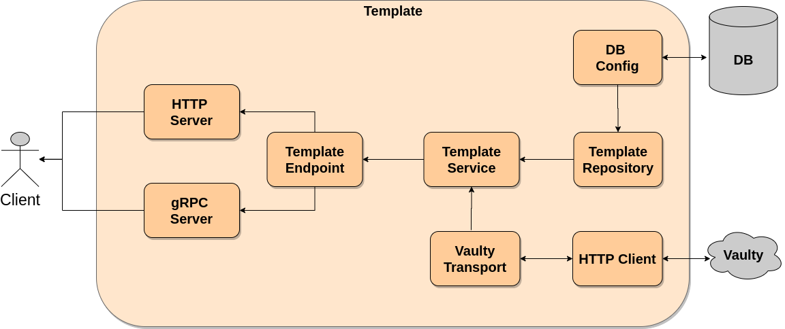

# axul_template

Microservicios de maanejo de templates
```sh
export PATH=$PATH:$HOME/go/bin
export PATH=$PATH:/usr/local/go/bin


evans -p 50051 -r
show package
show service
show message

desc SumRequest # descripcion

package default # usamos el default
service calculator
call Sum
```

